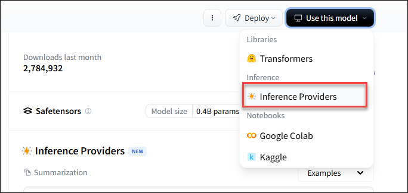

<!-- markdownlint-disable MD046 -->
<!-- markdownlint-disable MD007 -->

## Video 2 - Why use Open-Source

<!-- prettier-ignore-start -->
!!! Note
    Open-source models offer cost and privacy advantages over hosted models (e.g., OpenAI, Anthropic).
    These models can be hosted locally on a secure network, ensuring that sensitive prompts and responses
    are not exposed to external servers.
    They provide flexibility to choose the model that best fits the intended purpose. Smaller language
    models can be fine-tuned for specific tasks, while larger hosted _Large Language Models (LLMs)_
    may offer broader capabilities but less control over > customization and data privacy.
    Open-source models also allow complete control over updates, integrations, and deployment
    environments, making them ideal for organizations with strict compliance or internal infrastructure requirements.
<!-- prettier-ignore-end -->

## Video 3 - Finding Open-Source Models

Hugging face is the go to platform for open-source model where researchers and developers publish models

- <https://huggingface.co/>

<!-- prettier-ignore-start -->
!!! tip "Account Required"
    To run most models on Hugging Face, you need an account. Signing up is free.
<!-- prettier-ignore-end -->

#### Choosing the Right Model

A few simple considerations can help you narrow things down:

- **What it can do (Tasks)**:  
  Think about what you want the model to achieve. Are you generating text, creating images, working with multiple modalities, or analyzing visual data? Picking the right task category will instantly filter out models that aren’t relevant.

- **Popularity & Size (Sort)**:  
  Metrics like the number of downloads or the total parameters can give you a sense of how widely used or powerful a model is. While not the only measure of quality, they’re a useful starting point.

When using a model on Hugging Face, you can choose how to run it via **inference providers**. These determine where and how the model executes, whether in the cloud or locally.

1.Click the **Use this model** button on any model page. This opens options for running the model.



2.**Selecting a Provider**:

- Hugging Face offers default cloud execution for most models.
- You can also configure your own endpoints or local runtime for models that support it.


3.**Additional Options**: Some models may offer paid or specialized inference providers for faster performance or larger scale.

## Video 4 - Calling Hugging Face Models

#### Creating Access tokens

To call a `Hugging Face` model, first you need to create an access token.

1. Click on your **Profile** in the top-right corner of the page.
2. Select **Settings** from the dropdown menu.
3. Navigate to the **Access Tokens** section to manage your tokens.
4. Click **Create new token**
5. Set **Permissions** for the access token Read, Write, or Fine-grained

<!-- prettier-ignore-start -->
!!! Tip
    Create seperate access tokens for Development, Testing, and Production deployments
<!-- prettier-ignore-end -->

#### Adding Hugging Face to Project

- **Add API token** to a `.env` file in your project:

  ```env title="Add Token"
      HF_TOKEN=ABC1234
  ```

- **Install Hugging Face** inference package using `Bun`

  ```terminal title="Terminal"
      bun add @huggingface/infernece
  ```

<!-- prettier-ignore-start -->
!!! note
    Hugging Face offers a free tier for using the models, but the free tier has limitations like
    rate limiting and throttled performance. Free tier is practical for development and not production.
    For more information on creating a [dedicated endpoint](https://huggingface.co/pricing)
<!-- prettier-ignore-end -->

- **Adding inference** to project files

```js title="packages/server/llm/clients.ts"
import { InferenceClient } from "@huggingface/inference";

const inferenceClient = new InferenceClient(process.env.HF_TOKEN);

export const llmClient= {
    async generateText({
        id: response.id
        text: response.output_text,
    };
    ),
    async summarize(text: string) {
    const output = await inference.summarization({
        model: "facebook/bart-large-cnn",
        inputs: text,
        provider: "hf-inference",
    });

    return output.summary_text;
    }
}
```

- **Using the Service**

```js title="packages/server/services/review.service.ts"
// Update this line
const { text: summary } = await llmClient.generateText({
 model: 'gpt-4.1',
 prompt,
 temperature: 0.2,
 maxTokens: 500,
});
// To this
const summary = await llmClient.summarize(joinedReviews);
```

## Video 5 - Choosing the Right Model

<!-- prettier-ignore-start -->
!!! note
    In Video 4, when calling `Hugging Face` models, we used the BART model that was trained on CNN Daily News.  
    This model provides summarization, but the output is more geared toward summarizing news articles.
<!-- prettier-ignore-end -->

Search for a model that handles review summaries. This time we'll use `meta-llama/Llama-3.1-8B-Instruct`

#### Update inference

```js title="llama inference in Hugging Face"
const chatCompletion = await client.chatCompletion({
 model: 'meta-llama/Llama-3.1-8B-Instruct:novita',
 messages: [
  {
   role: 'user',
   content: 'What is the capital of France?',
  },
 ],
});
```

```js title="packages/server/llm/clients.ts"
import { InferenceClient } from "@huggingface/inference";
import summarizePrompt from "../prompts/summarize-reviews.txt";

const inferenceClient = new InferenceClient(process.env.HF_TOKEN);

export const llmClient= {
    async generateText({
        id: response.id
        text: response.output_text,
    };
    ),
    async summarizeReviews(reviews: string) {
const chatCompletion = await inferenceClient.chatCompletion({
    model: "meta-llama/Llama-3.1-8B-Instruct:novita",
    messages: [
        {
            role: "system",
            content: summarizePrompt,
        },
        {
            role: "users",
            content: text,
        }
    ],
});

    return chatCompletion.choices[0]?.message.content || "";
    }
}
```

## Video 6 - Running Models locally

> TODO

### Video 7 - Using Hugging Face Models with Ollama

> TODO

#### Video 8 - Calling Ollama Models

> TODO
