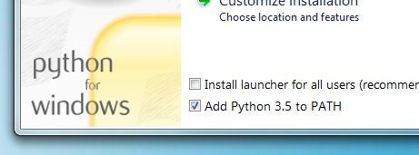

<!-- markdownlint-disable MD046 -->
# Zensical (MkDocs)

`MkDocs` is a static site generator that provides a simplistic way for generating documentation written in `markdown`. `MkDocs` alone has a rich feature set of plugins and themes that will handle your documentation needs. However, the user community has contributed vastly to this project and added additional packages that can be installed to improve upon `MkDocs`. One of the most highly used packages is `Zensical`.


!!! info "Name Change (2026)"

    Material for MkDocs was rebranded to **Zensical** in 2026.

    Existing documentation, package names, configuration settings, and community resources may still refer to **Material for MkDocs**. In most cases these references are interchangeable.


## Python Install

MkDocs requires **`Python`** and the Python package manager (**`pip`**) installed on your system. Newer installs of `Python` will include the package manager.

[Download Python](https://www.python.org/)

After install check installation of `Python` from the command line

```cmd title="Windows cmd"
python --version
Python 3.12.3

pip --version
pip 24.0
```

!!! note

    For Windows install of Python be sure to check the box to add Python to your **PATH**<br>
    (It's normally off by default)



## Zensical Install

=== ":simple-materialformkdocs: **Zensical**"

    ## Zensical
    
    This will automatically install these dependencies: `MkDocs`, `Markdown`, `Pygments` and `Python Markdown Extensions`.

    [Zensical Documentation](https://zensical.org/docs/get-started/#install-with-pip-windows)

    ```cmd title="Install"
    pip install zensical

    // Install a specific version
    pip install zensical=="9.*"
    ```

    ```cmd title="Check version"
    pip show zensical
    ```

    ```cmd title="Upgrade"
    pip install --upgrade --force-reinstall zensical
    ```

=== ":fontawesome-brands-markdown: **MkDocs**"

    ## MkDocs

    This will install `MkDocs` only. 

    [MkDocs Documentation](https://www.mkdocs.org/)

    Install `MkDocs` package using pip:

    ```cmd title="Windows cmd"
    pip install mkdocs
    ```

    After install check installation of `MkDocs` from the command line

    ```cmd title="Windows cmd"
    $mkdocs --version
    mkdocs, version 1.5.3 from C:...\Programs\Python\Python312\Lib\site-packages\mkdocs (Python 3.12)
    ```

## Creating a New Project

Open command line and navigate to the location where the project will be stored. To create a new `Zensical` project, run the following command from the command line.<br>
Then use the `cd` command to change directories to the newly created `Zensical` directory.

```cmd title="Windows cmd"
zensical new .
cd my-project
```

!!! tip
    In the example above the new `Zensical` project was called 'my-project' but any name can be used for the new project name.

## Python Virtual Environment

`Python 3` has a [built-in virtual environment][python-virtual-env] that will isolate project packages from other projects on your system. It is recommended to **activate the virtual environment each time** you open a `Python` project to work on it. The virtual environment will cease each time you close the shell or IDE from which you activated from.

[python-virtual-env]: https://realpython.com/what-is-pip/#using-pip-in-a-python-virtual-environment

!!! note
    The command lines below are executed while inside your `Python` project directory

=== ":fontawesome-brands-windows: **Windows**"

    ```cmd title="Windows cmd"
    # Make the virtual environment
    python -m venv venv

    # Activate the virtual environment
    venv\Scripts\activate.bat
    ```

=== ":material-git: **Git Bash**"

    ```bash title="Git Bash Windows"
    # Make the virtual environment
    python -m venv venv

    # Activate the virtual environment
    source venv/bin/activate
    ```

=== ":fontawesome-brands-linux: **Linux/macOS**"

    ```bash title="Shell"
    # Make the virtual environment
    python3 -m venv venv

    # Activate the virtual environment
    source venv/bin/activate
    ```

!!! note
    Reactivate an existing virtual environment by following the same instructions to activate.  There is no need to create a new virtual environment.

??? failure "Troubleshooting"

    In the event that Python and PiP isn't registering in your project.  The issue can occur when a virtual environment (`venv`) was created using an older Python installation and that installation was later upgraded, moved, or removed. The `pyvenv.cfg` file continues to reference the old Python executable, causing the virtual environment to fail.

    === "Assess"

        Notice that `python --version` references Python 3.12, while `where python` shows Python 3.14 exists on the system.

        ```cmd title="Check Python Version"
        python --version

        No Python at 'c:\users\blotter\AppData\Local\Programs\Python\Python312'
        ```

        ```cmd title="Locate Python Executables"
        where python

        c:\users\blotter\AppData\Local\Programs\Python\Python314
        ```

    === "Confirm"

        From the project root, inspect the virtual environment configuration.

        ```cmd title="Inspect pyvenv.cfg"
        type venv\pyvenv.cfg
        ```

        If the file references an older Python version, the virtual environment needs to be recreated.

        ```text title="Example pyvenv.cfg Output"
        home = c:\users\blotter\AppData\Local\Programs\Python\Python312
        include-system-site-packages = false
        version = 3.12.3
        executable = c:\users\blotter\AppData\Local\Programs\Python\Python312\python.exe
        command = c:\users\blotter\AppData\Local\Programs\Python\Python312\python.exe -m venv
        ```

    === "Fix"

        Recreate the virtual environment using the currently installed version of Python.

        ```cmd title="Deactivate Current Virtual Environment"
        deactivate
        ```

        === ":fontawesome-brands-windows: **Windows CMD**"

            ```cmd title="Delete Existing Virtual Environment"
            rmdir /s /q venv
            ```

        === ":fontawesome-brands-windows: **PowerShell**"

            ```powershell title="Delete Existing Virtual Environment"
            Remove-Item .\venv -Recurse -Force
            ```

        === ":fontawesome-brands-git-alt: **Git Bash**"

            ```bash title="Delete Existing Virtual Environment"
            rm -rf venv
            ```

        ```cmd title="Create New Virtual Environment"
        py -m venv venv
        ```

        ```cmd title="Verify"
        python --version
        pip --version
        ```

        ```cmd title="Confirm pyvenv.cfg"
        type venv\pyvenv.cfg
        ```

## Project layout

    mkdocs.yml    # The configuration file.
    docs/
        index.md  # The documentation homepage.
        ...       # Other markdown pages, images and other files.

## Build Site

Before deploying the `Zensical` project to the web, you must first build the documentation.

```cmd title="Windows cmd"
zensical build
```

This will create a new directory in your project called `site`. To view the content of the directory.

=== ":fontawesome-brands-windows: **Windows**"

    ```cmd title="Windows cmd"
    dir site
    ```

=== ":fontawesome-brands-linux: **Linux/macOS**"

    ```bash title="Shell"
    ls site
    ```

## Tutorial

The documentation above is outlined very well by [@james-willett](https://github.com/james-willett) in this YouTube video

---

:fontawesome-brands-youtube:{ style="color: #EE0F0F" } [How to setup Material for MkDocs](https://www.youtube.com/watch?v=Q-YA_dA8C20) by [@james-willett](https://github.com/james-willett)

---

## Plugin Catalog

:material-arrow-right: [MkDocs Plugin Catalog](https://github.com/mkdocs/catalog)
