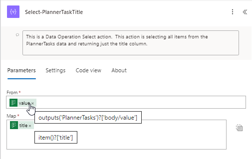
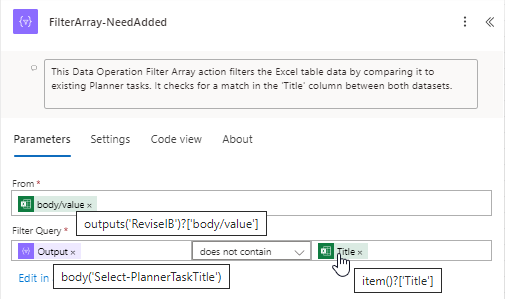

---
  - navigation
  - toc
---

# Arrays

## Compare Two Arrays (without using Apply to Each)

Comparing two arrays to find matches or differences doesn't have to be complicated with<br>
lots of Apply to Each actions.  Using the Select Data Operation action along with the Filter Array<br>
action can simplify the process and make the flow more efficient.

In this example, the flow is pulling in a table from Excel and data from Planner.  We are then comparing the `Title` column<br>
to find the missing information in Planner and adding it.

### Add a Select Data Operation action

This is a Data Operation Select action.  This action is selecting all items from the PlannerTasks data and returning just the title column.  

``` powerautomate
From input:
    @{outputs('PlannerTasks')?['body/value']}
Map input:
    @{item()?['title']}
```



### Add a Filter Array Data Operation action

This Data Operation Filter Array action filters the Excel table data by comparing it to existing Planner tasks. It checks for a match in the 'Title' column between both datasets.

``` powerautomate
From input:
    @{outputs('ReviseIB')?['body/value']}
Filter Query input:
    @not(contains(@{body('Select-PlannerTaskTitle')},@{item()?['Title']}))
```


