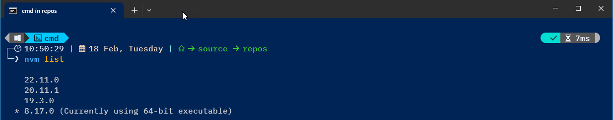
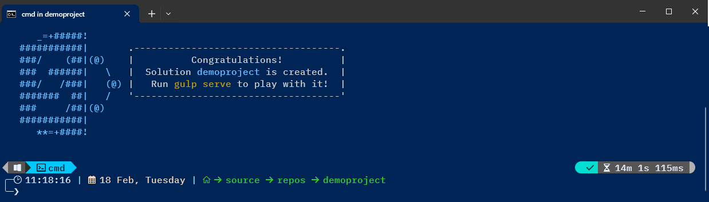

# Creating an SPFx Project

Open `cmd` command prompt

## NVM

```cmd title="Verify NVM Setup"
C:\Users\blotter> nvm list
```



```cmd title="Verify NPM Packages"
C:\Users\blotter> npm list -g --depth=0
```


## Create Project Folder

```cmd title="Navigating Folders"
C:\Users\blotter> cd repos
```

```cmd title="Create Project Directory"
C:\Users\blotter\repos> mkdir demoproject
```

```cmd title="Navigate to new Project Directory"
C:\Users\blotter\repos> cd demoproject
```

## Creating SharePoint Project

```cmd title="Run Yeoman Generator"
C:\Users\blotter\repos\demoproject> yo @microsoft/sharepoint
```


- [x] Solution name - name of project (advise all lowercase/no spaces)
- [x] Where to place files - current folder
- [x] Admin deploy solution - controls how project is deployed, can be changed
- [x] Client-side solution - options are webpart or extension
- [x] Web part name - your choice, typically the same as solution name
- [x] Web part description - enter description
- [x] Frawework - options are no JS framework, React, Knockout



## Install Development Certificate

```cmd title="Install Development Certificate"
C:\Users\blotter\repos\demoproject> gulp trust-dev-cert
```

!!! note
    This command just needs run once on the development machine. It is not local to the project folder. This allows `Gulp` to serve the project up in the hosted workbench with a trusted certificate

!!! warning
    It may prompt you for credentials to install the dev certificate

## Update Workbench

Microsoft has deprecated the local workbench starting with `SPFx v1.13` and only supports the hosted workbench served from a SharePoint site.  Append `_layouts/15/workbench.aspx` to the url where you will be testing the `SPFx` solution.

Inside your project navigate to the config folder, then `server.json` file.  Then update the `initialPage` property inside the file.


## Running Project

Preview and test the client-side web part in the SharePoint hosted workbench

```cmd title="Run Project"
gulp serve

gulp serve --nobrowser
```


## Important Project Files

| File | Description |
| --- | --- |
| :octicons-check-circle-fill-12:{ .greenCheck } package.json | Manages dependencies |
| :octicons-check-circle-fill-12:{ .greenCheck } serve.json | Configures local environment |
| :octicons-check-circle-fill-12:{ .greenCheck } mystrings.d.ts | Manages localization |
| :octicons-check-circle-fill-12:{ .greenCheck } WebPart.manifest.json | Manages localization |
| :octicons-check-circle-fill-12:{ .greenCheck } WebPart.ts | Main file manages imports, web part class, render method |

## Webpart File Components

### Imports

Imports: Includes necessary libraries such as React, SharePoint types, and custom components required for the web part.


### Web Part Class

The main TypeScript class that extends `BaseClientSideWebPart`. It defines the core logic, including lifecycle methods.


### Render Method

This function is responsible for outputting the `HTML` content of the web part. It can include `JSX` (if using `React`) or plain `DOM` manipulation.


### Property Pane Configuration

Defines customizable properties for the web part.


