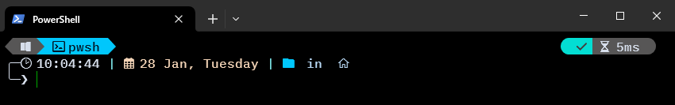
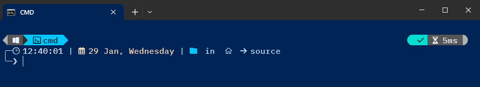

# Terminal configuration

Instruction for Windows terminal setup and configuration using Oh My Posh

!!! Info

    To display all icons it is recommended to install [Nerd Font](https://www.nerdfonts.com/)

## Install Nerd Font

Install [Nerd Font](https://www.nerdfonts.com/) from the website.  Recommend using `BlexMono Nerd Font`

Install method via Drag and Drop

1. Open the Fonts folder
    - Press `Win + R` to open the run dialog
    - Type `Control Fonts` and press `Enter` to open the Fonts folder

2. Unzip the font file downloaded
3. Drag and drop
    - Drag the font file from the File Explorer into the Fonts window.
        Windows will automatically install the font
4. Update individual application settings to use the Nerd Font

## Install Oh My Posh

Install `oh-my-posh` on windows using `winget`

!!! pied-piper ""

    === "Search"

        Search for `oh-my-posh` package on `winget`. Use the package `Id` in the install command. 

        ```cmd
        C:\Users\blotter>winget search oh-my-posh

        Name       Id                      Version Match               Source
        ----------------------------------------------------------------------
        oh-my-posh XP8K0HKJFRXGCK          Unknown                     msstore
        Oh My Posh JanDeDobbeleer.OhMyPosh 24.19.0 Moniker: oh-my-posh winget
        ```

    === "Install"

        Using the `Id` from the package install `oh-my-posh`

        ```cmd
        C:\Users\blotter>winget install JanDeDobbeleer.OhMyPosh
        ```

## Install Clink

Install `Clink` on Windows using `winget`. Clink is used due to no out-of-th-box support for Windows CMD for custom prompts.

!!! pied-piper ""
    === "Search"

        Search for `Clink` package on `winget`. Use the package `Id` in the install command. 

        ```cmd
        C:\Users\blotter>winget search Clink

        Name        Id                Version  Match        Source
        ----------------------------------------------------------
        Clink       chrisant996.Clink 1.7.7                 winget
        ```

    === "Install"

        Using the `Id` from the package install `Clink`

        ```cmd
        C:\Users\blotter>winget install chrisant996.Clink
        ```

## Configure PowerShell terminal

Setup for PowerShell terminal requires a change to your `$PROFILE`

1. Locating your Profile and view file contents

    !!! pied-piper ""

        === "Locate File"

            ```powershell
            C:\Users\blotter> $PROFILE

            Output:
            C:\Users\blotter\Documents\WindowsPowerShell\profile.ps1
            ```

        === "View File"

            ```powershell
            C:\Users\blotter> cat $PROFILE

            Output:
            Import-Module posh-git
            Import-Module PoShLog
            oh-my-posh init pwsh --config 'https://raw.githubusercontent.com/JanDeDobbeleer/oh-my-posh/main/themes/kushal.omp.json' | Invoke-Expression
            ```

2. Open the file and add the following to the file

    ```txt
    // Reference local theme
    oh-my-posh init pwsh --config C:/Users/blotter/themefolder/jandedobbeleer.omp.json | Invoke-Expression

    // Reference remote theme
    oh-my-posh init pwsh --config 'https://raw.githubusercontent.com/JanDeDobbeleer/oh-my-posh/main/themes/kushal.omp.json' | Invoke-Expression
    ```

3. Reload PowerShell Profile

    ```powershell
    C:\Users\blotter> . $PROFILE
    ```

Final configuration should look similar to this:



!!! tip

    Remember to update font preferences in each PowerShell applicaiton to use the Nerd Font

## Configure CMD terminal

1. Ensure [Install Clink](#install-clink) step completed

2. Create a new file called `oh-my-posh.lua` in the `Clink` program directory folder

    ```cmd title="Find Clink Directory"
    C:\Users\blotter>clink info
    ```

3. Add the following line to the `oh-my-pos.lua` file

    ```cmd title="oh-my-pos.lua"
    // Reference local theme
    load(io.popen('oh-my-posh init cmd --config C:/Users/blotter/jandedobbeleer.omp.json'):read("*a"))()

    // Reference remote theme
    load(io.popen('oh-my-posh init cmd --config "https://raw.githubusercontent.com/JanDeDobbeleer/oh-my-posh/main/themes/kushal.omp.json'):read("*a"))()
    ```

Final configuration should look similar to this:



!!! tip

    Remember to update font preferences in each `Windows Terminal` profile to use the Nerd Font

??? pied-piper "Custom Themes"

    === "Custom kushal theme"
    ```json
    {
  "$schema": "<https://raw.githubusercontent.com/JanDeDobbeleer/oh-my-posh/main/themes/schema.json>",
  "console_title_template": "{{ if .Root }}root @ {{ end }}{{ .Shell }} in {{ .Folder }}",
  "blocks": [
    {
      "alignment": "left",
      "segments": [
        {
          "background": "#575656",
          "foreground": "#D6DEEB",
          "leading_diamond": "\ue0b2",
          "properties": {
            "alpine": "\uf300",
            "arch": "\uf303",
            "centos": "\uf304",
            "debian": "\uf306",
            "elementary": "\uf309",
            "fedora": "\uf30a",
            "gentoo": "\uf30d",
            "linux": "\ue712",
            "macos": "\ue711",
            "manjaro": "\uf312",
            "mint": "\uf30f",
            "opensuse": "\uf314",
            "raspbian": "\uf315",
            "ubuntu": "\uf31c",
            "windows": "\ue70f"
          },
          "style": "diamond",
          "template": " {{ if .WSL }}\ue712 on {{ end }}{{ .Icon }} ",
          "type": "os"
        },
        {
          "background": "#00C7FC",
          "foreground": "#011627",
          "powerline_symbol": "\ue0b0",
          "style": "powerline",
          "template": " \uf489 {{ .Name }} ",
          "type": "shell"
        },
        {
          "background": "#EF541C",
          "foreground": "#D6DEEB",
          "powerline_symbol": "\ue0b0",
          "style": "powerline",
          "template": " \uf09c admin ",
          "type": "root"
        },
        {
          "type": "cmake",
          "style": "powerline",
          "powerline_symbol": "\ue0b0",
          "foreground": "#E8EAEE",
          "background": "#1E9748",
          "template": " \ue61e \ue61d cmake {{ .Full }} "
        },
        {
          "type": "python",
          "style": "powerline",
          "powerline_symbol": "\ue0b0",
          "properties": {
            "display_mode": "context"
          },
          "foreground": "#011627",
          "background": "#FFDE57",
          "template": "{{ if .Venv }}🐍 veno {{ end }}"
        },
        {
          "type": "go",
          "style": "powerline",
          "powerline_symbol": "\ue0b0",
          "foreground": "#ffffff",
          "background": "#7FD5EA",
          "template": " \u202d\ue626 {{ .Full }} "
        },
        {
          "type": "rust",
          "style": "powerline",
          "powerline_symbol": "\ue0b0",
          "foreground": "#193549",
          "background": "#99908A",
          "template": " \ue7a8 {{ .Full }} "
        },
        {
          "background": "#1BD4CD",
          "background_templates": [
            "{{ if or (.Working.Changed) (.Staging.Changed) }}#16B1AC{{ end }}",
            "{{ if and (gt .Ahead 0) (gt .Behind 0) }}#16B1AC{{ end }}",
            "{{ if gt .Ahead 0 }}#B787D7{{ end }}",
            "{{ if gt .Behind 0 }}#B787D7{{ end }}"
          ],
          "foreground": "#011627",
          "powerline_symbol": "\ue0b0",
          "properties": {
            "branch_icon": "\ue725 ",
            "fetch_stash_count": true,
            "fetch_status": true,
            "fetch_upstream_icon": true,
            "fetch_worktree_count": true
          },
          "style": "powerline",
          "template": " {{ .UpstreamIcon }}{{ .HEAD }}{{if .BranchStatus }} {{ .BranchStatus }}{{ end }}{{ if .Working.Changed }} \uf044 {{ .Working.String }}{{ end }}{{ if and (.Working.Changed) (.Staging.Changed) }} |{{ end }}{{ if .Staging.Changed }}<#CAEBE1> \uf046 {{ .Staging.String }}</>{{ end }}{{ if gt .StashCount 0 }} \ueb4b {{ .StashCount }}{{ end }} ",
          "type": "git"
        }
      ],
      "type": "prompt"
    },
    {
      "alignment": "right",
      "segments": [
        {
          "background": "#03DED3",
          "background_templates": ["{{ if gt .Code 0 }}#E44141{{ end }}"],
          "foreground": "#414141",
          "foreground_templates": ["{{ if gt .Code 0 }}#D6DEEB{{ end }}"],
          "leading_diamond": "\ue0b6",
          "properties": {
            "always_enabled": true
          },
          "style": "diamond",
          "template": " {{ if gt .Code 0 }}\uf00d{{ else }}\uf00c{{ end }} ",
          "type": "status"
        },
        {
          "background": "#575656",
          "foreground": "#D6DEEB",
          "properties": {
            "style": "roundrock",
            "threshold": 0
          },
          "style": "diamond",
          "template": " \uf252 {{ .FormattedMs }} ",
          "trailing_diamond": "\ue0b4",
          "type": "executiontime"
        }
      ],
      "type": "prompt"
    },
    {
      "alignment": "left",
      "newline": true,
      "segments": [
        {
          "foreground": "#D6DEEB",
          "style": "plain",
          "template": "\u256d\u2500",
          "type": "text"
        },
        {
          "foreground": "#F2D3B6",
          "properties": {
            "time_format": "<#D6DEEB>\ue641 15:04:05</> <#79DFE1>|</> \uf073 2 Jan, Monday"
          },
          "style": "plain",
          "template": "{{ .CurrentDate | date .Format }} <#79DFE1>|</>",
          "type": "time"
        },
        {
          "foreground": "#32CD32",
          "leading_diamond": "</>",
          "properties": {
            "home_icon": "\ueb06",
            "folder_separator_icon": " \uf061 ",
            "style": "agnoster_full",
            "max_depth": 3
          },
          "style": "diamond",
          "template": "{{ if .Root }} {{ .Parent }} {{else}} {{ .Path }} {{end}}",
          "type": "path"
        }
      ],
      "type": "prompt"
    },
    {
      "alignment": "left",
      "newline": true,
      "segments": [
        {
          "foreground": "#D6DEEB",
          "style": "plain",
          "template": "\u2570\u2500",
          "type": "text"
        },
        {
          "foreground": "#D6DEEB",
          "properties": {
            "always_enabled": true
          },
          "style": "plain",
          "template": "\u276f ",
          "type": "status"
        }
      ],
      "type": "prompt"
    }
  ],
  "osc99": true,
  "transient_prompt": {
    "background": "transparent",
    "foreground": "#FEF5ED",
    "template": "\ue285 "
  },
  "secondary_prompt": {
    "background": "transparent",
    "foreground": "#D6DEEB",
    "template": "\u2570\u2500\u276f "
  },
  "version": 3
}
    ```
